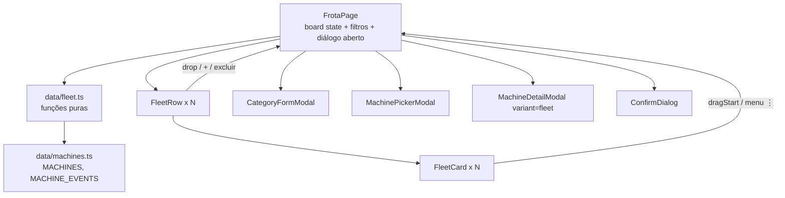

# Gerenciamento da Frota (Kanban) Design

**Spec**: `.specs/features/fleet-kanban/spec.md`
**Status**: Draft

---

## Approaches

| # | Abordagem | Prós | Contras |
| - | --------- | ---- | ------- |
| **A (recomendada)** | Estado do quadro em `useState` na `FrotaPage` + funções puras em `data/fleet.ts`; drag and drop **nativo do HTML**; menu ⋮ "Mover para" como alternativa de teclado/toque | Zero dependência nova; lógica testável sem DOM; mesmo padrão da Visão Geral e da Equipe | Drag nativo não funciona no toque nem no teclado (coberto pelo menu ⋮); sem animação de arrasto |
| B | Igual à A, mas com `@dnd-kit/core` | Toque, teclado e animação prontos | Dependência nova (~30 kB) para algo que o menu ⋮ já resolve; API a mais para manter |
| C | Store compartilhado (Context) entre Frota e Visão Geral | Uma fonte de verdade das máquinas | Nada na Frota altera a máquina (decisão do dono), então o compartilhamento não tem uso hoje |

Escolha: **A**. B fica como upgrade se o arrasto no celular virar requisito.

---

## Architecture Overview



A página guarda `board: FleetCategory[]` e um único `dialog` aberto por vez (mesmo padrão da `EquipePage`). Toda mudança do quadro passa por uma função pura de `fleet.ts` que devolve um novo array. O id da máquina sendo arrastada fica num `useRef` da página, não no `dataTransfer` (o jsdom não implementa `dataTransfer` de forma confiável e o arrasto nunca sai da página).

---

## Code Reuse Analysis

### Existing Components to Leverage

| Component | Location | How to Use |
| --------- | -------- | ---------- |
| `Modal` | `Frontend/src/components/common/Modal.tsx` | Casca dos modais Criar Categoria e Selecione as máquinas |
| `ConfirmDialog` | `Frontend/src/components/common/ConfirmDialog.tsx` | Confirmar "Excluir categoria" |
| `DialogButtons.module.css` | `Frontend/src/components/common/` | Botões Cancelar (vermelho) / Confirmar (azul) dos modais |
| `MachineDetailModal` | `Frontend/src/components/machines/MachineDetailModal.tsx` | Ganha `variant?: 'overview' \| 'fleet'`; `fleet` troca as linhas de info, os rótulos das abas e tira o rodapé |
| `MACHINES`, `MACHINE_EVENTS`, `eventsForMachine`, `DEFAULT_PERIOD` | `Frontend/src/data/machines.ts` | Fonte das máquinas, do último acidente e do período padrão |
| `formatEventDate`, `formatHours` | `Frontend/src/utils/format.ts` | Datas e horas nos cards |
| `TeamForm.module.css` | `Frontend/src/components/team/` | Estilo do input de nome da categoria |
| `VisaoGeralPage` | `Frontend/src/pages/VisaoGeralPage.tsx` | Padrão de toolbar (botão + busca + select) e de abrir/fechar detalhe |

### Integration Points

| System | Integration Method |
| ------ | ------------------ |
| Rota `/frota` | Já existe em `appRoutes.tsx`; só troca o conteúdo de `FrotaPage` |
| i18n | Novo módulo `fleet.*` nos 7 idiomas + `fleet` em `REQUIRED_MODULES` do `i18n.test.ts` |

---

## Components

### `data/fleet.ts`

- **Purpose**: Modelo do quadro e todas as transformações puras.
- **Location**: `Frontend/src/data/fleet.ts`
- **Interfaces**:
  - `initialBoard(machines: Machine[]): FleetCategory[]` - 4 categorias iniciais com a posição inicial da spec
  - `moveMachine(board, machineId, toCategoryId): FleetCategory[]` - tira de onde estiver e põe no fim do destino; mesma categoria → devolve `board` inalterado
  - `removeMachine(board, machineId): FleetCategory[]`
  - `addMachines(board, categoryId, machineIds: string[]): FleetCategory[]` - ignora ids que já têm categoria
  - `createCategory(board, nome: string, cor: string): FleetCategory[]` - `kind: 'custom'`, id único, no fim
  - `deleteCategory(board, categoryId): FleetCategory[]` - só `custom`; outras → `board` inalterado
  - `unassignedMachines(board, machines): Machine[]`
  - `categoryNameError(nome: string, existingNames: string[]): 'required' | 'duplicate' | null`
  - `isHexColor(value: string): boolean` - `/^#[0-9a-f]{6}$/i`
  - `matchesMachine(machine, query): boolean` - nome ou código, sem maiúsculas
  - `lastAccidentDate(machineId, events): string | undefined`
- **Dependencies**: `data/machines.ts`
- **Reuses**: tipos `Machine`, `MachineEvent`

### `FleetCard`

- **Purpose**: Card arrastável de uma máquina, com campos que variam pelo `kind` da linha.
- **Location**: `Frontend/src/components/fleet/FleetCard.tsx`
- **Interfaces**: `{ machine, kind, lastAccident?, moveTargets: {id, nome}[], onOpen(machine), onDragStart(machineId), onMove(machineId, categoryId), onRemove(machineId) }`
- **Dependencies**: lucide `Forklift`, `MoreVertical`
- **Reuses**: botão esticado do `MachineCard` para abrir sem aninhar botões; `formatEventDate`, `formatHours`

### `FleetRow`

- **Purpose**: Uma categoria: rótulo colorido com contador, busca da linha, período (só Acidentes), excluir (só custom), cards com rolagem horizontal, área de soltar e "+".
- **Location**: `Frontend/src/components/fleet/FleetRow.tsx`
- **Interfaces**: `{ category, label, machines: Machine[], total, query, renderCard(machine), onDrop(categoryId), onAdd(categoryId), onDelete?(categoryId), period?, onPeriodChange? }`. A filtragem da linha (busca local + período) fica dentro da linha; a página passa já filtrado pela busca global.
- **Reuses**: período com `<input type="date">` como no `MachineDetailModal`

### `CategoryFormModal`

- **Purpose**: "Criar Categoria": quadrado de cor que abre popover com 7 cores + hex, input de nome, Cancelar/Criar.
- **Location**: `Frontend/src/components/fleet/CategoryFormModal.tsx`
- **Interfaces**: `{ existingNames: string[], onSubmit(nome, cor), onClose() }`
- **Reuses**: `Modal`, `DialogButtons.module.css`, `TeamForm.module.css`, `categoryNameError`, `isHexColor`

### `MachinePickerModal`

- **Purpose**: "Selecione as máquinas": campo com chips removíveis, busca, lista com check, Cancelar/Confirmar.
- **Location**: `Frontend/src/components/fleet/MachinePickerModal.tsx`
- **Interfaces**: `{ machines: Machine[], onConfirm(ids: string[]), onClose() }` - recebe só as máquinas sem categoria
- **Reuses**: `Modal`, `DialogButtons.module.css`, `matchesMachine`

### `MachineDetailModal` (modificado)

- **Purpose**: Variante `fleet` do detalhe.
- **Change**: prop `variant?: 'overview' | 'fleet'` (padrão `overview`, nada muda na Visão Geral). Em `fleet`: linhas Setor, Funcionário (`operadorConectado?.nome`), Tempo Uso (Sessão) (`tempoSessaoMinutos`), Nome Dispositivo; abas "Histórico de reparos" (`manutencao`) e "Histórico de alertas" (`acidente`), começando em reparos; sem `footer`. `onEdit`/`onDelete` passam a ser opcionais.

### `FrotaPage`

- **Purpose**: Monta o quadro: título, toolbar (Cadastrar categoria, Search, filtro de categoria), linhas, "+" final, diálogos.
- **Location**: `Frontend/src/pages/FrotaPage.tsx`
- **State**: `board`, `query`, `categoryFilter` (`'all' | id`), `dialog: {type: 'create'} | {type: 'add', categoryId} | {type: 'delete', categoryId} | {type: 'detail', machineId} | null`, `draggingId` (ref).

---

## Data Models

```typescript
export type CategoryKind = 'acidentes' | 'ativas' | 'manutencao' | 'disponiveis' | 'custom'

export interface FleetCategory {
  id: string          // 'acidentes' | 'ativas' | 'manutencao' | 'disponiveis' | `custom-${n}`
  kind: CategoryKind
  nome: string        // vazio nas 4 iniciais (nome vem de t(`fleet.category.${kind}`)); preenchido nas custom
  cor: string         // '#RRGGBB'
  machineIds: string[]
}

export const CATEGORY_COLORS = ['#3A9CFF', '#3AFF3A', '#FFC93A', '#FF7A3A', '#9B3AFF', '#FF3AC4', '#3AE7FF']
```

**Relationships**: `machineIds` aponta para `Machine.id`. Invariante: um id aparece em no máximo uma categoria (garantido por `moveMachine`/`addMachines`).

---

## Error Handling Strategy

| Error Scenario | Handling | User Impact |
| -------------- | -------- | ----------- |
| Nome vazio / repetido | `categoryNameError` no submit | Mensagem abaixo do campo, modal continua aberto |
| Hex inválido | `isHexColor` falso → cor anterior mantida | Quadrado de cor não muda |
| Soltar fora de uma linha | Nenhum `onDrop` dispara | Card fica onde estava |
| Soltar na mesma linha | `moveMachine` devolve o mesmo board | Nada muda |
| Nenhuma máquina sem categoria | Picker mostra mensagem e desabilita Confirmar | Usuário entende que não há o que adicionar |

---

## Risks & Concerns

| Concern | Location (file:line) | Impact | Mitigation |
| ------- | -------------------- | ------ | ---------- |
| `.specs/STATE.md` não existe, mas `docs/frontend.md` cita AD-001/003/005 | `docs/frontend.md:84` | Decisões de projeto sem registro | Já sinalizado na feature team-management; esta feature registra a escolha de DnD nativo só no design (a pasta `.specs` está no `.gitignore`) |
| `MachineCard` tem `aria-label` do ⋮ fixo em português ("Mais ações para") | `Frontend/src/components/machines/MachineCard.tsx:57` | Texto não traduzido | `FleetCard` usa chave i18n; o do `MachineCard` fica fora do escopo |
| `filterMachines` busca por código e setor, não por nome | `Frontend/src/data/machines.ts:231` | Não serve para a busca da Frota (nome ou código) | `matchesMachine` novo em `fleet.ts`; não altera a Visão Geral |
| DnD nativo sem suporte a toque/teclado | - | Usuário de celular/teclado não arrasta | Menu ⋮ "Mover para" cobre o mesmo fluxo (MOVE-03) |

---

## Tech Decisions

| Decision | Choice | Rationale |
| -------- | ------ | --------- |
| Drag and drop | API nativa do HTML, id arrastado num `useRef` da página | Sem dependência; o arrasto nunca sai da página |
| Nomes das categorias iniciais | `nome` vazio + chave i18n por `kind` | Traduz nos 7 idiomas sem duplicar texto no mock |
| Validação de nome repetido | Compara com os nomes exibidos (traduzidos) | O usuário vê os nomes traduzidos |
| Cor do rótulo | `color-mix(in srgb, cor 20%, white)` de fundo e a cor na borda/ícone | Uma cor por categoria gera o visual do frame sem tabela de tons |
