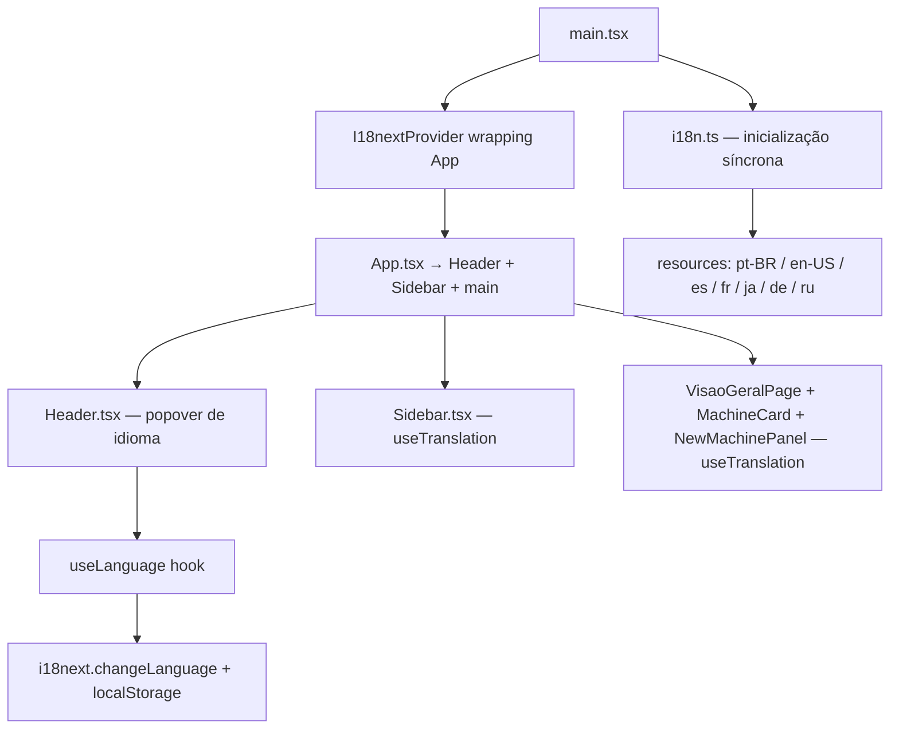

# i18n — Suporte de Idiomas: Design

**Spec**: `.specs/features/i18n-suporte-idiomas/spec.md`
**Status**: Draft

---

## Architecture Overview

A camada de i18n é inserida na árvore React acima do roteador. `i18next` é inicializado de forma síncrona com os `resources` inline (objetos JSON importados em `i18n.ts`). O hook `useLanguage` é a única API pública para componentes que precisam trocar de idioma; todos os componentes que exibem texto usam `useTranslation()` do `react-i18next` diretamente.



**Estratégia de resources:** todos os 7 arquivos `translation.json` são importados estaticamente em `i18n.ts` e passados via `resources`. Isso evita fetch de rede e funciona offline — custo de bundle aceitável para a escala atual (~7 × ~2 KB = ~14 KB não-gzipado).

**Inicialização síncrona:** `i18next.init()` com `resources` e `initImmediate: false` garante que o idioma está disponível antes da primeira renderização. Sem `Suspense` obrigatório (AC I18N-04).

---

## Code Reuse Analysis

### Existing Components to Leverage

| Componente / Arquivo | Localização | Como usar |
| -------------------- | ----------- | --------- |
| `Header.tsx` | `src/components/layout/Header.tsx` | Substituir `setSelectedLanguage` local por `changeLanguage` do `useLanguage`; converter strings hardcoded |
| `Sidebar.tsx` | `src/components/layout/Sidebar.tsx` | Aplicar `useTranslation` nas labels de navegação |
| `VisaoGeralPage.tsx` | `src/pages/VisaoGeralPage.tsx` | `t('machines.searchPlaceholder')`, `t('machines.registerButton')`, etc. |
| `MachineCard.tsx` | `src/components/machines/MachineCard.tsx` | Labels de status, rótulos de campo |
| `NewMachinePanel.tsx` | `src/components/machines/NewMachinePanel.tsx` | Labels de formulário, botões |
| `LANGUAGES` array em `Header.tsx` | `src/components/layout/Header.tsx` | Mover para `useLanguage` como fonte única de verdade |

### Integration Points

| Sistema | Como a feature conecta |
| ------- | ---------------------- |
| `main.tsx` | Adicionar `import './config/i18n'` antes do render (efeito colateral de inicialização) |
| `localStorage` | Lido em `i18n.ts` para `lng` inicial; escrito em `useLanguage.changeLanguage` |
| `vitest` / `@testing-library/react` | Wrapper `i18nextProvider` nos testes existentes não será necessário (init síncrona); novos testes de hook usam `renderHook` padrão |

---

## Components

### `src/config/i18n.ts`

- **Purpose**: Inicializar `i18next` com todos os recursos e configuração base; efeito colateral executado uma vez no boot.
- **Location**: `src/config/i18n.ts`
- **Interfaces**: módulo sem export default; importado por side-effect em `main.tsx`.
- **Dependencies**: `i18next`, `react-i18next`, arquivos `src/locales/*/translation.json`
- **Reuses**: padrão de `src/config/` já existente (diretório criado, vazio)

```typescript
// Assinatura conceitual (não implementação)
i18next.use(initReactI18next).init({
  resources,          // objeto indexado por locale
  lng: localStorage.getItem('liftech-lang') ?? 'pt-BR',
  fallbackLng: 'pt-BR',
  ns: ['translation'],
  defaultNS: 'translation',
  interpolation: { escapeValue: false }, // React já escapa
  initImmediate: false,                  // síncrono
})
```

---

### `src/hooks/useLanguage.ts`

- **Purpose**: Expor `language`, `changeLanguage(code)` e `languages` como API pública para troca de idioma, encapsulando `i18next` e `localStorage`.
- **Location**: `src/hooks/useLanguage.ts`
- **Interfaces**:
  ```typescript
  interface LanguageOption {
    code: string
    label: string    // nome no idioma atual da UI (chave de tradução)
    nativeLabel: string // nome no próprio idioma (ex: "Deutsch")
    flag: string
  }

  function useLanguage(): {
    language: string
    changeLanguage: (code: string) => void
    languages: LanguageOption[]
  }
  ```
- **Dependencies**: `i18next`, `react-i18next` (`useTranslation`)
- **Reuses**: padrão de hook custom já presente no projeto (pasta `src/hooks/` referenciada na issue)

> **Nota sobre `label`:** o nome do idioma no popover deve ser exibido no idioma atual da UI (AC I18N-17). A chave `languages.pt-BR`, `languages.en-US`, etc. em cada `translation.json` resolve isso sem lógica especial. `nativeLabel` é fixo (ex: "Português (Brasil)") e pode ser exibido como sublabel ou tooltip.

---

### `src/locales/[locale]/translation.json` × 7

- **Purpose**: Arquivo de tradução por locale; namespace único `translation`.
- **Location**: `src/locales/{pt-BR,en-US,es,fr,ja,de,ru}/translation.json`
- **Interfaces**: objeto JSON com 4 módulos de chaves:

```jsonc
{
  "common": {
    "search": "...",
    "filter": "...",
    "noResults": "...",
    "register": "...",
    "cancel": "...",
    "save": "...",
    "close": "..."
  },
  "navigation": {
    "overview": "...",
    "fleet": "...",
    "team": "...",
    "alerts": "...",
    "notFound": "..."
  },
  "machines": {
    "registerButton": "...",
    "searchPlaceholder": "...",
    "filterDefault": "...",
    "statusAvailable": "...",
    "statusInUse": "...",
    "statusMaintenance": "...",
    "sessionTime": "...",
    "sector": "...",
    "operator": "...",
    "noOperator": "...",
    "emptyState": "...",
    "newMachineTitle": "...",
    "labelId": "...",
    "labelName": "...",
    "labelSector": "...",
    "labelMac": "..."
  },
  "languages": {
    "title": "...",
    "pt-BR": "...",
    "en-US": "...",
    "es": "...",
    "fr": "...",
    "ja": "...",
    "de": "...",
    "ru": "..."
  }
}
```

- **Dependencies**: nenhuma
- **Reuses**: n/a (arquivos novos)

---

### Modificações em componentes existentes

| Arquivo | Mudança |
| ------- | ------- |
| `main.tsx` | `import './config/i18n'` (side-effect antes do render) |
| `Header.tsx` | Substituir `LANGUAGES` local + `setSelectedLanguage` por `useLanguage()`; converter strings hardcoded (`"Escolha um idioma"`, `"Selecionar idioma"`) para `t('languages.title')`, etc. |
| `Sidebar.tsx` | `useTranslation()`; labels de navegação via `t('navigation.*')` |
| `VisaoGeralPage.tsx` | `useTranslation()`; `t('machines.*')` em todos os textos |
| `MachineCard.tsx` | `useTranslation()`; status, labels de campo |
| `NewMachinePanel.tsx` | `useTranslation()`; labels, placeholders, botões |
| `AlertasPage.tsx`, `EquipePage.tsx`, `FrotaPage.tsx`, `NotFoundPage.tsx` | `useTranslation()`; títulos de stub |

---

## Data Models

### `LanguageOption`

```typescript
interface LanguageOption {
  code: string        // ex: 'pt-BR'
  label: string       // chave de tradução resolvida para o idioma atual da UI
  nativeLabel: string // nome fixo no idioma nativo (ex: '日本語')
  flag: string        // emoji de bandeira
}
```

### `VALID_LANGUAGES` (constante)

```typescript
const VALID_LANGUAGES = ['pt-BR', 'en-US', 'es', 'fr', 'ja', 'de', 'ru'] as const
type SupportedLanguage = typeof VALID_LANGUAGES[number]
```

Usado para validar `localStorage` na inicialização (AC I18N-12).

---

## Error Handling Strategy

| Cenário de erro | Tratamento | Impacto ao usuário |
| --------------- | ---------- | ------------------ |
| `localStorage` inacessível (privado/SSR) | `try/catch` em leitura/escrita; silencioso, usa PT-BR | Nenhum — PT-BR como padrão |
| Código de idioma inválido em `localStorage` | Verificar contra `VALID_LANGUAGES`; usar PT-BR | Nenhum — degradação graciosa |
| Chave de tradução ausente num locale | `fallbackLng: 'pt-BR'` resolve automaticamente | Texto em PT-BR (aceitável) |
| `i18next.changeLanguage` rejeita (promise) | `.catch` silencioso; language permanece atual | Nenhum visível |

---

## Risks & Concerns

| Concern | Localização | Impacto | Mitigação |
| ------- | ----------- | ------- | --------- |
| `Header.tsx` tem estado local `selectedLanguage` duplicado do i18next | `Header.tsx:32` | Após implementação i18n, o estado local fica obsoleto e pode divergir | Remover `useState<string>('pt-BR')` do Header; derivar tudo de `useLanguage().language` |
| `PAGE_TITLES` em `Header.tsx` usa strings hardcoded em PT | `Header.tsx:22-27` | Permanecerão em PT mesmo após troca de idioma se não forem convertidas | Converter para `t('navigation.*')` como parte da conversão de textos (AC I18N-18) |
| Testes existentes (`MachineCard.test.tsx`, `VisaoGeralPage.test.tsx`) renderizam strings hardcoded em PT | `src/test/` | Após conversão para chaves de tradução, os textos renderizados mudam; testes quebram se procurarem strings PT literais | Adaptar assertions dos testes existentes para usar as chaves `t()` ou manter o init i18n no setup de testes (`setup.ts`) |
| `src/config/` existe mas está vazio | `src/config/` | Sem risco funcional; apenas confirma que a pasta existe | Usar diretamente sem criar |

---

## Tech Decisions

| Decisão | Escolha | Rationale |
| ------- | ------- | --------- |
| Resources inline vs. lazy-load | Resources inline em `i18n.ts` | App pequena; sem risco de bundle; evita flash de texto sem tradução |
| Namespace | Único (`translation`) | 4 módulos de chaves são suficientes; múltiplos namespaces adicionam configuração sem ganho |
| `initImmediate` | `false` (síncrono) | Elimina a necessidade de `<Suspense>` e garante que `t()` funciona na primeira renderização |
| `I18nextProvider` vs. `import` side-effect | `import './config/i18n'` em `main.tsx` sem Provider explícito | `initReactI18next` já registra o plugin; o Provider não é necessário quando `resources` são inline |
| Chave de localStorage | `liftech-lang` | Descritiva, sem colisão com outras chaves |
| Validação de idioma inválido | Verificar contra array `VALID_LANGUAGES` antes de usar | Simples, sem biblioteca extra |

> **AD-006 (projeto):** `i18next` + `react-i18next` são as bibliotecas oficiais de i18n do projeto Liftech Frontend. Recursos inline; namespace único `translation`; fallback PT-BR. Registrar em `.specs/STATE.md` após aprovação do design.
