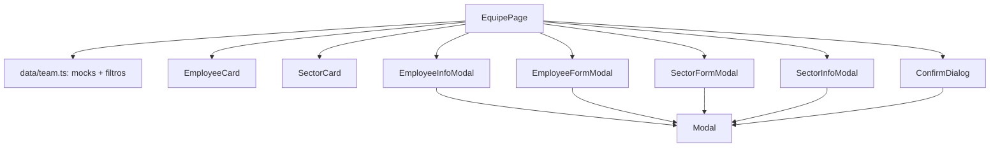

# Gestão de Equipe e Setores Design

**Spec**: `.specs/features/team-management/spec.md`
**Status**: Draft

---

## Architecture Overview

`EquipePage` guarda duas listas em `useState`, inicializadas com mocks de `data/team.ts`. Cada seção filtra com funções puras e renderiza cards. Os modais são componentes controlados pela página; `onSave`/`onConfirm` devolvem valores e a página altera as listas. Quando a API existir, o `useState` vira chamada em `services/`, sem mexer nos cards e modais (mesma estratégia de `VisaoGeralPage`).



Decisão de abordagem: um único `Modal` genérico (backdrop, Escape, `role="dialog"`, `aria-modal`, botão fechar) usado pelos quatro diálogos. `NewMachinePanel` tem esse comportamento embutido num drawer com CSS próprio; não é refatorado agora (fora do escopo, evita risco nos testes existentes).

---

## Code Reuse Analysis

### Existing Components to Leverage

| Component | Location | How to Use |
| --------- | -------- | ---------- |
| `VisaoGeralPage` | `Frontend/src/pages/VisaoGeralPage.tsx` | Padrão de estado local, toolbar (botão, busca, select) e empty state; copiar a estrutura |
| `VisaoGeralPage.module.css` | `Frontend/src/pages/` | Base de estilo da toolbar e do grid |
| `filterMachines` | `Frontend/src/data/machines.ts` | Mesmo formato para `filterEmployees` e `filterSectors` |
| `NewMachinePanel` | `Frontend/src/components/machines/` | Referência de Escape, backdrop e `aria-*` |
| `useTranslation` | `react-i18next` | Todo texto novo sob o módulo `team` |
| lucide-react | dependência | `Trash2`, `Pencil`, `Search`, `Plus`, `Eye`, `EyeOff`, `Clock`, `User`, `Warehouse`, `X` (AD-001 do doc: único sistema de ícones) |

### Integration Points

| System | Integration Method |
| ------ | ------------------ |
| Rotas | `/equipe` já aponta para `EquipePage`; nada a mudar |
| Header | `ROUTE_KEYS['/equipe']` passa a usar `team.pageTitle` ("Gerenciamento da Equipe e Setores"); a Sidebar mantém `navigation.team` |
| i18n | Módulo `team` nos 7 `translation.json`; `REQUIRED_MODULES` de `i18n.test.ts` ganha `team` |

---

## Components

### `data/team.ts`
- **Location**: `Frontend/src/data/team.ts`
- **Interfaces**:
  - `EMPLOYEES: Employee[]` (11) e `SECTORS: Sector[]` (8) - mocks que reproduzem o Figma (7 Permitido/Negado misturados)
  - `filterEmployees(list, { query?, access? }): Employee[]`
  - `filterSectors(list, { query? }): Sector[]`
  - `nextEmployeeCode(list): string` - maior `EMP-NNN` + 1
  - `isUsernameTaken(list, usuario, ignoreId?): boolean` - sem diferenciar maiúsculas
- **Reuses**: forma de `filterMachines`

### `components/common/Modal.tsx`
- **Purpose**: casca de diálogo (backdrop, Escape, fechar, título, `role="dialog"`)
- **Interfaces**: `Modal({ title, onClose, children })`
- Clicar no backdrop e Escape chamam `onClose`; Escape para propagação para não fechar um modal por baixo.

### `components/common/ConfirmDialog.tsx`
- **Interfaces**: `ConfirmDialog({ title, message, onConfirm, onCancel })` sobre `Modal`; botões Cancelar (vermelho, como no Figma) e Excluir.

### `components/team/EmployeeCard.tsx`
- **Interfaces**: `{ employee, onOpen, onToggleAccess, onEdit, onDelete }`; toggle é `<button role="switch" aria-checked>`; rótulos acessíveis com o nome do funcionário.

### `components/team/EmployeeFormModal.tsx`
- **Interfaces**: `{ employee?: Employee, existing: Employee[], onSave(values: EmployeeFormValues), onClose }`
- Título muda por modo (cadastrar/editar). Validação no submit: obrigatórios + usuário duplicado (`isUsernameTaken` com `ignoreId`). Senha com `type` alternado pelo ícone de olho. Erros limpos ao abrir.

### `components/team/EmployeeInfoModal.tsx`
- **Interfaces**: `{ employee, onClose }`; campos `readOnly`, senha com olho, sem botões de ação (frame "Detalhe Funcionário").

### `components/team/SectorCard.tsx`, `SectorFormModal.tsx`, `SectorInfoModal.tsx`
- `SectorCard({ sector, onOpen, onEdit, onDelete })`: corpo clicável abre leitura; lápis e lixeira usam `stopPropagation`.
- `SectorFormModal({ sector?, onSave, onClose })`: nome e unidade obrigatórios.
- `SectorInfoModal({ sector, onClose })`: campos `readOnly`, sem botões de ação.

### `pages/EquipePage.tsx` (+ `.module.css`)
- Duas seções em cartões brancos como no Figma. Um único estado `dialog` (união: nenhum | funcionário form | setor form | setor info | confirmar exclusão) garante um modal por vez.
- IDs novos: contador local, como `nextMachineId` em `VisaoGeralPage`.

---

## Data Models

```typescript
export type Access = 'Permitido' | 'Negado'

export interface Employee {
  id: string
  matricula: string        // EMP-084, gerada
  nome: string
  telefone: string
  cargo: string
  horarioEntrada: string   // "HH:mm" ou ''
  horarioSaida: string     // "HH:mm" ou ''
  usuario: string
  senha: string            // só mock
  acesso: Access
}

export interface Sector {
  id: string
  nome: string
  unidade: string
}
```

Valores de `Access` ficam em pt-BR no dado (mesmo padrão de `MachineStatus`) e são traduzidos na exibição.

---

## Risks & Concerns

| Concern | Mitigation |
| ------- | ---------- |
| Senha em texto puro no mock e preenchida no modal de edição (o Figma mostra isso) | Só mock em memória; campo `type=password` por padrão; não logar. Na integração, o backend guarda hash e a edição deixa a senha em branco = não alterar. Registrar como decisão ao integrar |
| `docs/frontend.md` cita `.specs/STATE.md` (AD-001, AD-003, AD-005), mas o arquivo não existe no repositório | Criar `STATE.md` com as decisões desta feature (AD-006 em diante é ambíguo; numerar a partir de AD-001 e anotar a lacuna) ou confirmar com o time onde ficou o histórico |
| `i18n.test.ts` exige módulos fixos por locale | Adicionar `team` a `REQUIRED_MODULES` na mesma task das traduções |
| `NewMachinePanel` duplica a lógica de modal | Não refatorar agora; abrir tarefa futura para migrar para `Modal` |
| Textos em ja/ru/de/fr/es gerados sem revisão nativa | Tratar como rascunho; revisão do time antes de produção |
| Títulos dos frames "Cadastrar Funcionário" (diz "Editar…") e "Editar Setor" (diz "Cadastrar…") parecem erro de cópia no Figma | Usar títulos coerentes com a ação; confirmar com o design |
| Header tem teste que pode fixar o título de `/equipe` | Rodar `Header.test.tsx` na task do Header e atualizar a expectativa com a nova chave |
