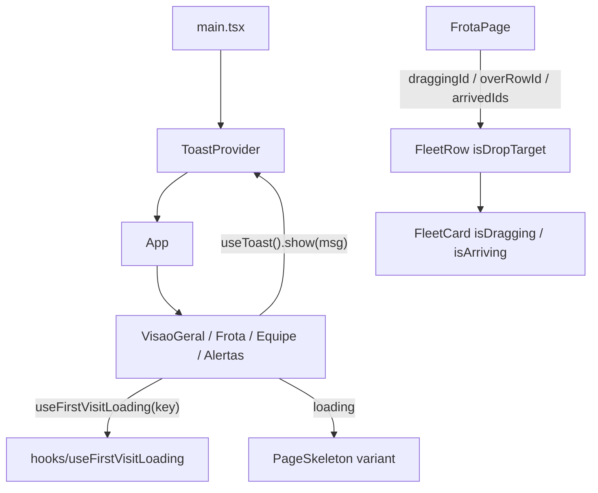

# Polimento da interface Design

**Spec**: `.specs/features/ui-polish/spec.md`
**Status**: Draft

---

## Approaches

| # | Abordagem | Prós | Contras |
| - | --------- | ---- | ------- |
| **A (recomendada)** | CSS puro para animações e shimmer; um hook `useFirstVisitLoading` + um `PageSkeleton` com variantes; um `ToastProvider` próprio (~60 linhas) com contexto | Zero dependência; cada peça pequena e testável | Sem animação de saída (fora do escopo) |
| B | `framer-motion` + `react-hot-toast` | Saída animada e toasts prontos | 2 dependências (~50 kB) para efeitos que CSS resolve; outro estilo de API |

Escolha: **A**.

---

## Architecture Overview



- **Skeleton**: cada página chama `useFirstVisitLoading('<pagina>')` junto com os outros hooks e, se `true`, retorna `<PageSkeleton variant=... />` no lugar do conteúdo (toolbar inclusa, SKEL-04). O hook guarda as páginas já vistas num `Set` de módulo (dura a sessão; recarregar zera) e só marca como vista quando o timer termina.
- **Arrasto**: o `useRef` de hoje vira `useState` (`draggingId`), para re-renderizar o card esmaecido. `overRowId` vem de `dragover`/`dragleave` da linha. `arrivedIds` guarda os ids recém-chegados e limpa após 1 s (`setTimeout` por lote).
- **Animações**: `@keyframes` nos CSS Modules do `Modal`, do menu do `FleetCard` e do popover de cores; regra global de `prefers-reduced-motion` em `index.css`.
- **Avisos**: `ToastProvider` com lista `{id, message}`; cada toast agenda a própria remoção por id (fechar antes não afeta os outros). `useToast()` sem provider devolve `{ show: () => {} }`.

---

## Code Reuse Analysis

| Component | Location | How to Use |
| --------- | -------- | ---------- |
| `Modal` | `Frontend/src/components/common/Modal.module.css` | Ganha `@keyframes` de entrada |
| `popover-in` | `Frontend/src/components/layout/Header.module.css:79` | Mesmo padrão (fade + deslocamento) no menu ⋮ e no popover de cores |
| `FleetCard`, `FleetRow`, `FrotaPage` | `Frontend/src/components/fleet/`, `Frontend/src/pages/FrotaPage.tsx` | Props novas `isDragging`, `isArriving`, `isDropTarget`, `onDragOverRow`/`onDragLeaveRow` |
| `--px` | `Frontend/src/pages/FrotaPage.module.css` | Skeleton da Frota usa a mesma escala |
| Grids das páginas | `VisaoGeralPage.module.css` `.grid`, `EquipePage.module.css` `.grid`, `AlertasPage.module.css` `.grid` | O skeleton reusa as classes de grid de cada página via prop `gridClassName` para ter o mesmo layout (sem salto) |

---

## Components

### `hooks/useFirstVisitLoading.ts`

- **Interface**: `useFirstVisitLoading(key: string, delayMs = MOCK_LATENCY_MS): boolean`
- `MOCK_LATENCY_MS = import.meta.env.MODE === 'test' ? 0 : 600` exportado do mesmo arquivo; `resetVisitedPages()` exportado só para testes.
- `delayMs === 0` ou página já vista → `false` desde o primeiro render.

### `components/common/PageSkeleton.tsx`

- **Interface**: `{ variant: 'grid' | 'kanban' | 'team', count?: number, gridClassName?: string }`
- Renderiza `<div aria-busy="true">` + `<span role="status" className="visually-hidden">Carregando...</span>` + blocos `aria-hidden`. `grid`: N cards; `kanban`: 3 linhas com rótulo + 4 cards; `team`: 2 seções (8 + 4).

### `components/common/Toast.tsx`

- **Interface**: `ToastProvider({children})`, `useToast(): { show(message: string): void }`
- Região fixa no canto inferior direito, `role="status"` `aria-live="polite"`; cada item com botão fechar (`aria-label` "Fechar aviso"); remoção em 4 s.

### Mudanças

- `FleetCard`: `isDragging?`, `isArriving?` (classes CSS); animação do menu.
- `FleetRow`: `isDropTarget?`, `onDragOverRow?(id)`, `onDragLeaveRow?(id)`.
- `FrotaPage`: estado de arrasto, `arrivedIds`, skeleton, avisos.
- `VisaoGeralPage`, `EquipePage`, `AlertasPage`: skeleton (+ avisos nas duas primeiras).
- `main.tsx`: envolve `<App />` com `ToastProvider`.

---

## Data Models

```typescript
interface ToastItem { id: number; message: string }
```

---

## Error Handling Strategy

| Error Scenario | Handling | User Impact |
| -------------- | -------- | ----------- |
| Sair da página durante o skeleton | Cleanup cancela o timer; página não marcada como vista | Na volta, skeleton de novo (curto) |
| `dragleave` disparado ao passar sobre filhos da linha | Ignora quando `relatedTarget` está dentro da linha | Destaque não pisca |
| Drop fora de linha | `dragend` limpa `draggingId` e `overRowId` | Nada muda |
| `useToast` sem provider | Contexto padrão no-op | Nenhum erro |

---

## Risks & Concerns

| Concern | Location (file:line) | Impact | Mitigation |
| ------- | -------------------- | ------ | ---------- |
| ~400 testes esperam conteúdo imediato | `Frontend/src/test/pages/*.test.tsx` | Skeleton quebraria todos | `MOCK_LATENCY_MS = 0` em modo de teste; testes de skeleton passam `delayMs` explícito via `vi.mock` do módulo |
| `Set` de páginas vistas é estado global de módulo | `hooks/useFirstVisitLoading.ts` | Vaza entre testes | `resetVisitedPages()` exportado e chamado nos testes do skeleton |
| `dragleave` dispara ao entrar em filhos | `FleetRow` | Destaque piscando | Checagem de `relatedTarget` (design acima) |

---

## Tech Decisions

| Decision | Choice | Rationale |
| -------- | ------ | --------- |
| Animações | CSS `@keyframes` | Sem dependência; `prefers-reduced-motion` global resolve acessibilidade |
| Toasts | Provider próprio | Escopo pequeno (texto + fechar); evita lib |
| Skeleton | Atraso simulado só na 1ª visita | Escolha do dono; quando houver API, `loading` vem da requisição e o `PageSkeleton` é reaproveitado |
