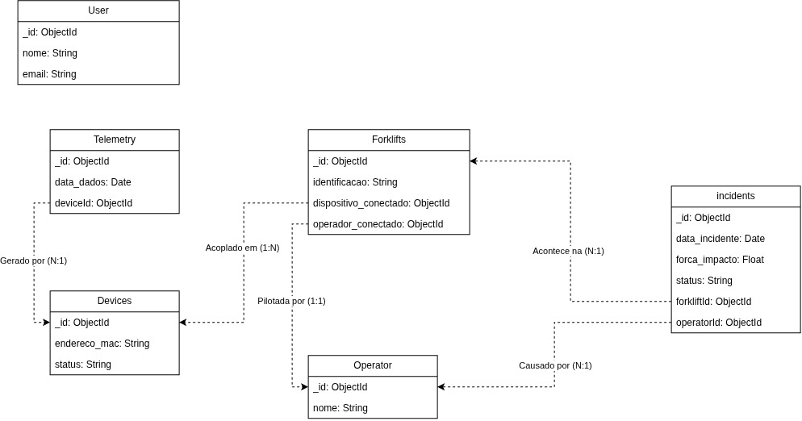

# Modelagem de Dados - Liftech

Este documento detalha as entidades e o mapeamento do banco de dados (MongoDB / Mongoose) do projeto Liftech.

## Padrões Adotados
- **Arquivos e Classes**: Utilizamos nomes no **Singular** (ex: `device.ts`, `Device`).
- **Atributos / Propriedades**: Todas as propriedades são declaradas em **camelCase** no banco de dados e no código (ex: `dataIncidente`, `enderecoMac`).
- **Chaves Estrangeiras (Foreign Keys)**: Campos que guardam referências (ObjectIds) de outras coleções possuem o sufixo `Id` (ex: `dispositivoId`, `operadorId`).

## Diagrama de Relacionamento
O diagrama visual de como as entidades se comunicam pode ser encontrado em:

*(Nota: as entidades no diagrama original sofreram padronizações de nomenclatura documentadas abaixo)*

## Entidades e Schemas

### 1. User (`user.ts`)
Representa o usuário do sistema, geralmente um Gestor ou Administrador que acessa a plataforma web.
- `nome` (String): Nome completo.
- `role` (String): Papel de acesso ou cargo no sistema (ex: "Admin", "Supervisor").

### 2. Operator (`operator.ts`)
Representa o motorista/piloto das empilhadeiras.
- `nome` (String): Nome do operador.

### 3. Device (`device.ts`)
O equipamento físico (hardware/sensor) que é acoplado a uma empilhadeira para captar telemetria.
- `enderecoMac` (String): Endereço físico único de rede.
- `status` (String): Status atual do hardware.

### 4. Telemetry (`telemetry.ts`)
Coleção que guarda as leituras constantes de dados gerados pelos dispositivos. Ideal para Time Series.
- `dataDados` (Date): Timestamp de quando a métrica foi lida.
- `dispositivoId` (ObjectId): Referência para o `Device` (relação N:1).

### 5. Forklift (`forklift.ts`)
A empilhadeira física, que contém o status atual do seu uso.
- `identificacao` (String): Código ou frota.
- `dispositivoConectadoId` (ObjectId): Qual `Device` está atualmente rastreando esta empilhadeira.
- `operadorConectadoId` (ObjectId): Quem é o `Operator` pilotando a máquina neste exato instante.

### 6. Incident (`incident.ts`)
Registro de anomalias (batidas, paradas bruscas).
- `dataIncidente` (Date): Data e hora da ocorrência.
- `forcaImpacto` (Number): Gravidade / impacto lido pelo sensor.
- `status` (String): Status de tratamento do incidente.
- `empilhadeiraId` (ObjectId): Referência para a `Forklift` onde ocorreu o evento.
- `operadorId` (ObjectId): Referência do `Operator` envolvido na ocasião.
